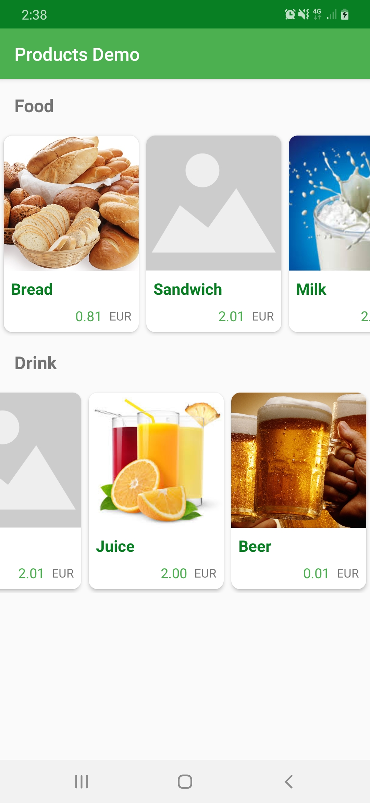
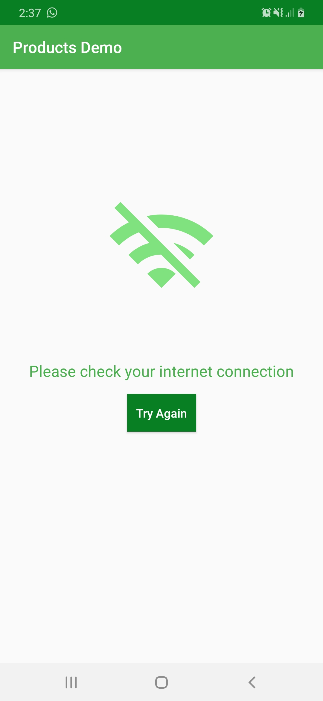
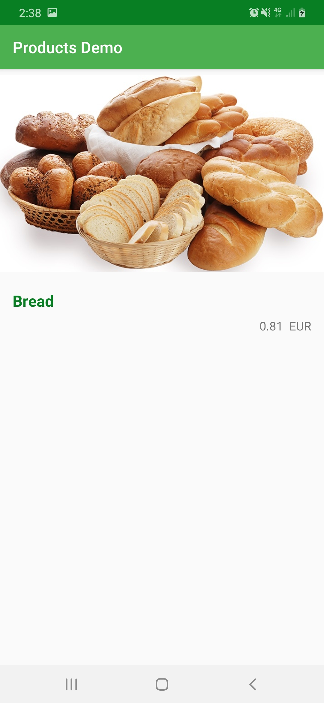

# Mobiquity Android Assignment

Mobiquity Android assignment for display products demo app

<table>
  <tr>
    <td>Product List</td>
     <td>On Network Error</td>
     <td>Product Details</td>
  </tr>
  <tr>
    <td></td>
    <td></td>
    <td></td>
  </tr>
 </table>
 
# Language
- Kotlin

## Architecture

Using Model-View-ViewModel (MVVM) architecture with the Repository and Data-Source
pattern to limiting coupling between application layers and components which provides better codebase to be more testable, maintainable and also scaling in the future.

# Libraries and Tech Used
- `View Binding`: provides better performace and lighter weight in comparing with DataBiniding
- `Navigation Component`: For navigating between Fragments
- `Dagger 2`: For Dependency Injection
- `Retrofit & Coroutines`: For APIs request
- `Picasso`: For loading images
- `Testing`: Using JUnit, Esspresso and Mockito 
